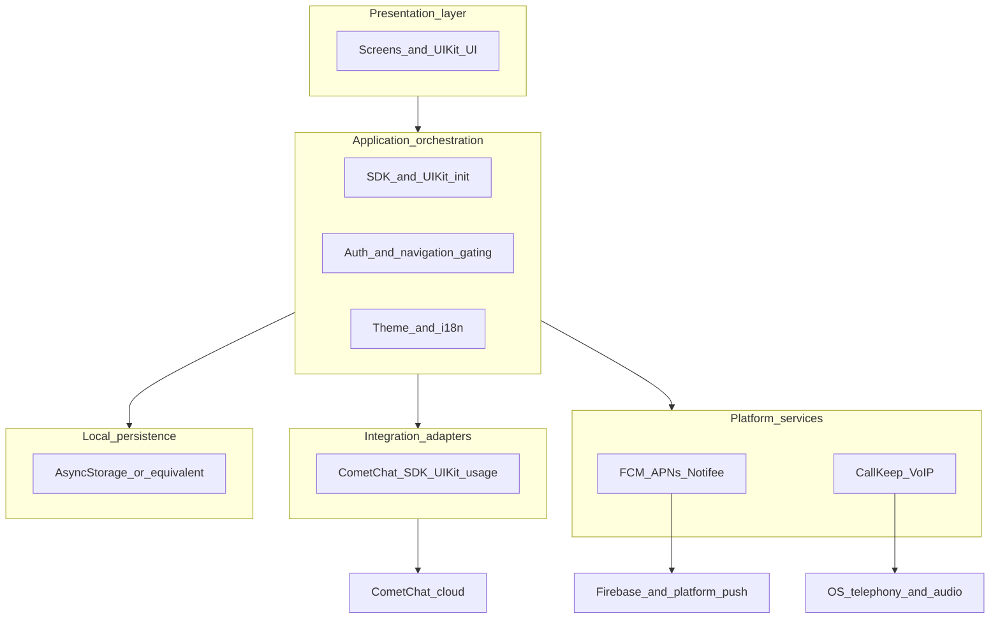
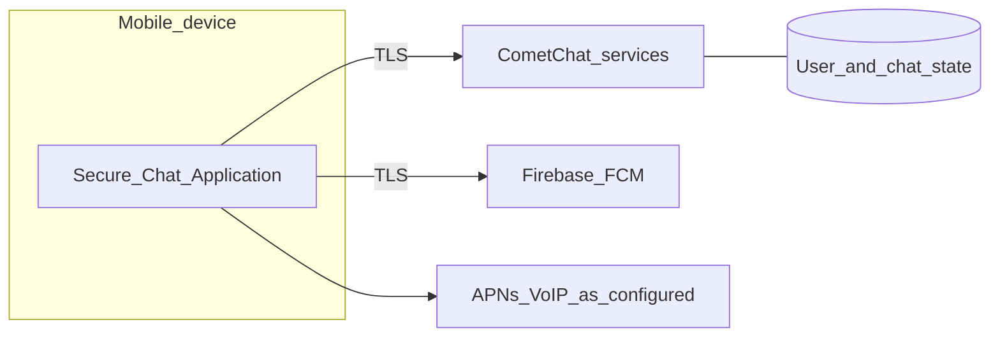
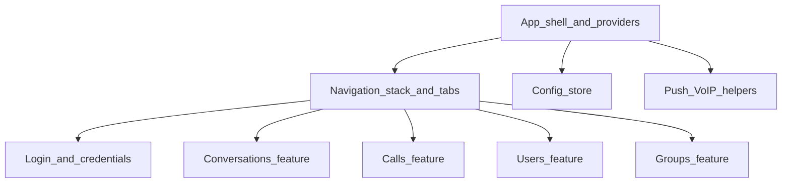
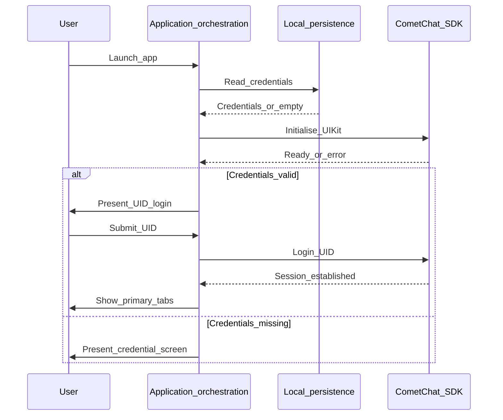
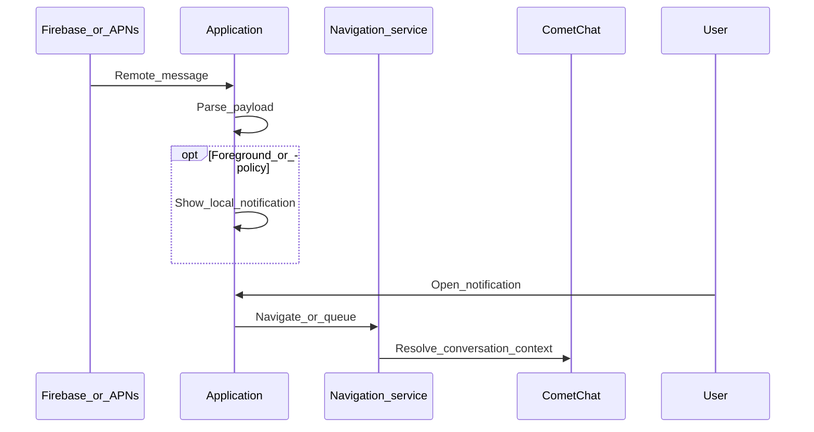
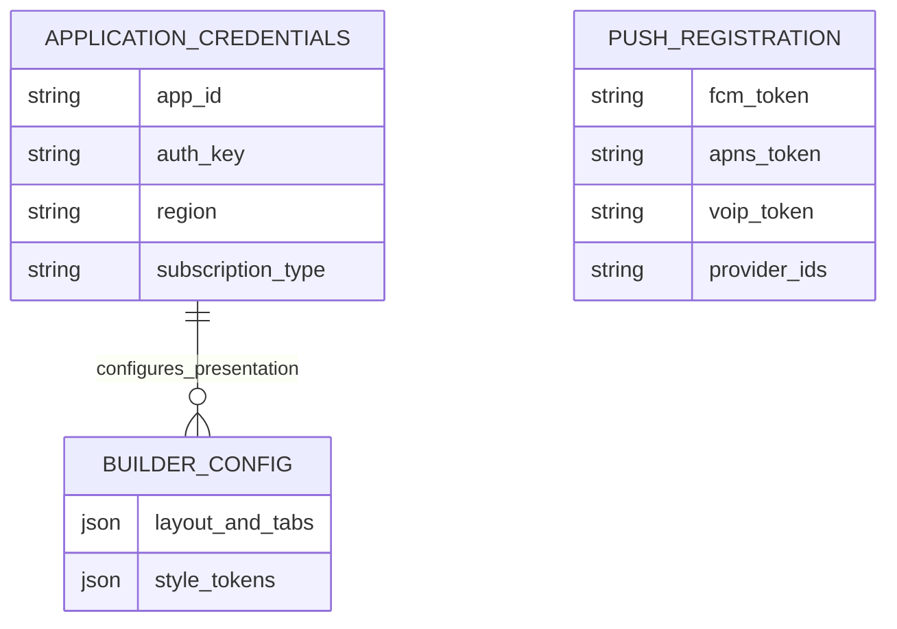

# System Design

## Introduction

System design translates the analysed requirements for the Secure Chat Application (Chapter 4) into a **coherent structure** that can guide implementation and evaluation. The design specifies how a cross-platform mobile **client** will integrate CometChat cloud services, platform notification and telephony facilities, and local configuration—without introducing a first-party application server, consistent with the requirements gathering and analysis narrative.

The decomposition below aligns with the **intended** module layout suggested by the reference tree [`repository root`](../../../) (root application shell, navigation, configuration store, feature-oriented components, and utilities for push and calls). Terminology uses **future-oriented** phrasing: the design states what the system **will** comprise and how responsibilities **will** be allocated, independent of any claim that implementation is complete.

Traceability from requirements to this chapter is recorded in [`academic-requirements-traceability-design.md`](academic-requirements-traceability-design.md).

---

## 5.1 Architectural design

### 5.1.1 Design context and constraints

The Secure Chat Application will operate as a **thin client**: user identity, messaging state, presence, and call signalling **will** be mediated by **CometChat** cloud APIs and UIKit abstractions. The project **will not** specify a bespoke relational backend owned by the student; instead, **NFR-011** (third-party service integration) and **FR-001** (SDK initialisation) anchor the architectural boundary. Additional external nodes **will** include **Firebase Cloud Messaging** (and platform push services such as APNs on iOS) for remote notifications, and **native** audio, video, and VoIP surfaces exposed through the Expo/React Native stack and selected native modules (for example CallKeep and VoIP handlers), satisfying **FR-014**, **FR-015**, and **FR-016**.

### 5.1.2 Logical architecture (layers)

The design specifies the following **logical layers**:

1. **Presentation layer** — React Native screens and CometChat UIKit-driven user interface components for conversations, calls, users, groups, and auxiliary flows (for example credential capture, QR configuration, encryption notices). This layer **will** realise **FR-007** through **FR-013**, **FR-017**, and the visible aspects of **FR-006**.
2. **Application orchestration** — Central lifecycle and cross-cutting coordination: CometChat SDK and UIKit initialisation (**FR-001**), authentication gating and navigation readiness (**FR-002**, **FR-003**, **FR-006**), theme and internationalisation providers (**FR-004**, **NFR-006**, **NFR-007**), and global error containment (**NFR-002**).
3. **Integration adapters** — Typed usage of CometChat SDK and UIKit APIs for messaging, search, threads, groups, and calls; the adapter concept **will** keep vendor calls concentrated and maintainable (**NFR-003**).
4. **Platform services** — Push token acquisition and registration with CometChat (**FR-015**), local notification presentation and payload-driven navigation (**FR-016**), and native call UI plus VoIP lifecycle hooks (**FR-013**, **FR-014**).
5. **Local persistence** — Asynchronous key–value (or equivalent) storage for application credentials, builder configuration JSON, and provider identifiers (**FR-002**, **FR-004**, **FR-005**, **NFR-004**, **NFR-005**).

### 5.1.3 Physical and deployment view

The system **will** ship as **two** platform binaries (iOS and Android) produced from a **single** React Native / Expo codebase (**NFR-001**, **NFR-008**). Build reproducibility **will** rely on declared dependency versions and Expo configuration. Runtime permissions and background modes required for camera, microphone, notifications, and VoIP **will** be declared in application manifests (**NFR-009**). No dedicated project-owned server process appears in the deployment diagram; operational traffic **will** flow between each installed client and vendor-operated endpoints.

### 5.1.4 Major software components

The design maps functional responsibilities to **major components** whose names and placement **will** mirror the reference structure for traceability: a root application module (for example `App.tsx`) **will** host providers and global listeners; **`navigation`** **will** define a root stack navigator, a tab navigator, and a navigation service for imperative routes and deferred navigation (**FR-006**, **FR-016**); **`config`** **will** expose a store for builder-driven settings (**FR-004**, **NFR-004**); **`components/login`** **will** capture CometChat application credentials and perform UID login (**FR-002**, **FR-003**); **`components/conversations`** **will** implement conversation lists, message views, threads, search, group administration screens, QR import, and encryption UX (**FR-005**, **FR-007**–**FR-011**, **FR-017**); **`components/calls`** **will** cover call logs, call details, and ongoing sessions (**FR-012**); **`components/users`** and **`components/groups`** **will** support directory and group browsing (**FR-010**, **FR-011**); **`utils`** **will** centralise push registration, notification helpers, VoIP handling, and shared constants (**FR-014**–**FR-016**, **NFR-005**).

### 5.1.5 Summary

The architecture **will** remain **client-centric** and **vendor-mediated**: CometChat **will** own server-side chat and call semantics; the application **will** orchestrate integration, platform services, and local configuration. This structure **will** satisfy the bootstrap, navigation, integration, and portability requirements identified in Chapter 4 (**FR-001**–**FR-003**, **FR-006**, **NFR-001**, **NFR-008**, **NFR-011**).

---

## 5.2 Use case design

### 5.2.1 Actors

- **End user** — Authenticated chat participant who sends and receives messages, manages groups, places and receives calls, and interacts with notifications.
- **Installer or demonstrator** — Person who supplies CometChat **application** credentials (and optionally imports builder configuration via QR) before ordinary users sign in; may coincide with the end user in small deployments.

### 5.2.2 Catalogue of primary use cases

The following consolidated use cases **will** cover the functional scope while limiting redundancy. Each lists representative requirement identifiers for traceability.

| ID | Use case name | Primary FRs |
|----|----------------|-------------|
| UC-01 | Configure CometChat application credentials | FR-002, FR-001 |
| UC-02 | Sign in with user identifier (UID) | FR-003, FR-001 |
| UC-03 | Browse primary areas via dynamic tabs | FR-004, FR-006 |
| UC-04 | Exchange messages in conversations and threads | FR-007, FR-008 |
| UC-05 | Search messages in context | FR-009 |
| UC-06 | Discover users and open profiles | FR-010 |
| UC-07 | Create or join groups and moderate membership | FR-011 |
| UC-08 | Review call history and join ongoing session | FR-012 |
| UC-09 | Handle incoming call with decline and busy rules | FR-013, FR-014 |
| UC-10 | Register device for push and open app from notification | FR-015, FR-016 |
| UC-11 | Import builder configuration via QR | FR-005 |
| UC-12 | View encryption and privacy messaging | FR-017 |

### 5.2.3 Use case specifications (selected)

**UC-01 — Configure CometChat application credentials**

- **Actor:** Installer or demonstrator.
- **Preconditions:** Application installed; network available.
- **Main flow:** The actor enters valid CometChat application identifier, authentication key, and region (or equivalent fields). The system persists credentials, re-initialises the SDK with an all-users subscription, and proceeds toward user login when credentials validate.
- **Alternate flows:** Missing or invalid credentials **will** keep the actor on the credential surface until resolved (**FR-002**).
- **Postconditions:** Credentials **will** be available for subsequent SDK initialisation sessions; user login **will** remain unavailable until UC-02 succeeds.

**UC-02 — Sign in with user identifier (UID)**

- **Actor:** End user.
- **Preconditions:** UC-01 satisfied; SDK initialised (**FR-001**).
- **Main flow:** The actor submits a UID accepted by CometChat. The system establishes an authenticated session and navigates to the primary tabbed experience (**FR-003**, **FR-006**).
- **Alternate flows:** Authentication failure **will** surface an error without entering the main navigator.
- **Postconditions:** End user **will** access tabs and stack routes permitted for authenticated users.

**UC-04 — Exchange messages in conversations and threads**

- **Actor:** End user.
- **Preconditions:** UC-02 satisfied.
- **Main flow:** The actor opens a conversation, sends and receives messages through UIKit-integrated views, and optionally opens a thread for a parent message to view thread-scoped history (**FR-007**, **FR-008**).
- **Postconditions:** Messages **will** reside in CometChat-managed state; the client **will** reflect real-time updates as provided by the SDK.

**UC-09 — Handle incoming call with decline and busy rules**

- **Actor:** End user.
- **Preconditions:** UC-02 satisfied; platform permissions granted (**NFR-009**).
- **Main flow:** An incoming call **will** present native or UIKit-mediated incoming-call UI; the actor **will** accept or decline. If another call is active, the design **will** enforce busy rejection per **FR-013**.
- **Postconditions:** Call state **will** synchronise with CometChat; native surfaces **will** release resources on termination (**FR-014**).

**UC-10 — Register device for push and open app from notification**

- **Actor:** End user; platform push services (system).
- **Preconditions:** UC-02 satisfied; notification permissions granted where required.
- **Main flow:** The system **will** obtain push tokens (FCM and, on iOS, APNs/VoIP as applicable), register them with CometChat using configured provider identifiers (**FR-015**). When a notification arrives, the system **will** display it according to foreground/background rules and **will** navigate to the indicated conversation or context when the user acts on the payload (**FR-016**).
- **Postconditions:** Device **will** remain registered until tokens refresh or the user signs out; navigation **will** respect readiness of the navigation container (**FR-006**).

Further use cases (**UC-03**, **UC-05**–**UC-08**, **UC-11**, **UC-12**) **will** follow the same specification pattern: preconditions referencing authentication and configuration, main flows aligned with listed FRs, and postconditions that emphasise CometChat-backed state or local configuration updates as appropriate.

---

## 5.3 Data flow and process design

### 5.3.1 Trust boundaries

Three boundaries **will** structure analysis of data flow:

1. **Device boundary** — Separates the mobile device from the public network.
2. **Application trust boundary** — Separates application code and local storage from OS-mediated services (push, telephony).
3. **Vendor boundary** — Separates the client from CometChat and Firebase endpoints (**NFR-011**).

Sensitive material **will** include CometChat application credentials and push tokens (**NFR-005**); message content **will** traverse vendor-controlled transports under CometChat’s security model, not custom cryptography implemented in this project (**FR-017**).

### 5.3.2 Bootstrap and authentication flows

**SDK initialisation and credential resolution.** On launch, the application **will** read stored credentials when present, initialise CometChat UIKit with region, subscription type, and keys (**FR-001**), and set loading state until completion. If credentials are absent or invalid, the flow **will** direct the user to credential entry (**FR-002**).

**UID login.** After successful SDK readiness, UID login **will** invoke CometChat authentication and, on success, transition navigation to the tab container (**FR-003**, **FR-006**).

### 5.3.3 Messaging and search

Sending and receiving messages **will** flow through CometChat SDK and UIKit components: user actions **will** trigger SDK calls; inbound events **will** update UI state (**FR-007**). Thread and search flows **will** pass identifiers for parent messages or search scopes into dedicated screens (**FR-008**, **FR-009**).

### 5.3.4 Configuration import and theming

QR import **will** fetch builder JSON, persist it, and update the configuration store so that tab order, feature flags, colours, and typography **will** apply on subsequent renders (**FR-004**, **FR-005**).

### 5.3.5 Push notification and deep linking

Inbound push **will** be received by platform handlers, optionally transformed into local notifications, and correlated with navigation actions. If the navigation container is not yet ready, the design **will** queue navigation intent and flush it when the container becomes ready (**FR-016**, **FR-006**).

### 5.3.6 Calls and VoIP

Outgoing and incoming call flows **will** coordinate CometChat call objects with native call UI (CallKeep) and VoIP token handling on iOS (**FR-012**–**FR-014**). The design **will** ensure that incoming call presentation and termination events **remain** consistent with platform expectations.

---

## 5.4 Database and data structure design

### 5.4.1 Scope

The Secure Chat Application **will not** introduce a project-owned **server-side** relational database. Persistent chat history, user directories beyond the client cache, and call metadata **will** reside in **CometChat-managed** storage accessible through APIs (**NFR-011**). Chapter 5 therefore specifies **local** data structures and **client-held** configuration only.

### 5.4.2 Local conceptual entities

The design **will** treat the following conceptual entities on device:

| Concept | Purpose | Linked requirements |
|---------|---------|------------------------|
| **Application credentials record** | Stores CometChat app ID, auth key, region, and related fields for repeated initialisation | FR-002, NFR-005 |
| **Builder configuration document** | JSON describing tabs, colours, typography, and feature flags | FR-004, FR-005, NFR-004 |
| **Session indicator** | Marks whether a user session is considered active for routing (exact representation **will** follow SDK state) | FR-003 |
| **Push registration metadata** | Associates FCM/APNs/VoIP tokens with provider identifiers for CometChat registration | FR-015, NFR-005 |
| **Deferred navigation payload** | Holds minimal routing information when navigation must wait for container readiness | FR-006, FR-016 |

### 5.4.3 Local conceptual schema

Remote entities (for example **Conversation**, **Message**, **Group**, **Call**) **will** be modelled by CometChat SDK types at runtime and **will** not be duplicated as a custom SQL schema in this project.

---

## 5.5 Interface design

### 5.5.1 Navigation model

The design **will** employ a **root stack navigator** for authentication entry points, modal flows, conversation stacks, call detail routes, and auxiliary screens (for example QR and search). A **bottom tab navigator** **will** host the primary areas: Chats, Calls, Users, and Groups. Tab **order and visibility** **will** be driven by builder configuration (**FR-004**, **FR-006**). The navigation container **will** expose a service for imperative navigation and for processing **pending** routes after push or cold start (**FR-016**).

### 5.5.2 Screen inventory

The following table **will** align major screens with functional requirements. Route names **will** follow constants analogous to those in the reference application (for example `AppCredentials`, `SampleUser`, `BottomTabNavigator`, `Messages`, `ThreadView`, `SearchMessages`, `UserInfo`, `GroupInfo`, `AddMember`, `ViewMembers`, `TransferOwnershipSection`, `BannedMember`, `OngoingCallScreen`, `CallDetails`, `QRScreen`).

| Screen or route (conceptual) | Purpose | FRs |
|------------------------------|---------|-----|
| Application credentials | Enter CometChat app credentials | FR-002, FR-001 |
| User login (UID) | Authenticate end user | FR-003 |
| Tab: Chats | Conversation list | FR-007 |
| Tab: Calls | Call history entry | FR-012 |
| Tab: Users | User directory | FR-010 |
| Tab: Groups | Group list / entry | FR-011 |
| Messages | Active conversation | FR-007 |
| Thread view | Thread replies | FR-008 |
| Search messages | In-conversation search | FR-009 |
| User info | Profile and actions | FR-010 |
| Group info / members / moderation | Group administration | FR-011 |
| Ongoing call | Active call UI | FR-012, FR-014 |
| Call details | Historical call detail | FR-012 |
| QR screen | Import builder configuration | FR-005 |
| Encryption banner / modal | Privacy copy | FR-017 |

### 5.5.3 Visual and interaction design

**Theming** **will** map builder colour and typography tokens into CometChat theme objects for light and dark modes where applicable (**FR-004**, **NFR-006**). **Internationalisation** **will** rely on CometChat’s i18n provider for vendor strings; custom strings (for example certain labels) **will** remain English unless extended (**NFR-007**). **Encryption notice** components **will** communicate privacy expectations without implying custom end-to-end encryption implemented locally (**FR-017**).

---

## 5.6 Security design considerations

### 5.6.1 Client-boundary security

The design **will** treat the device as a **controlled but not hardened** environment suitable for a prototype or demonstration (**NFR-005**). Application credentials and push tokens **will** reside in local storage; the design **will** assume device access controls (screen lock, OS sandbox) as the primary physical defence. **No** additional custom cryptographic protocol **will** be specified in this project; transport security **will** depend on vendor APIs over TLS (**NFR-011**).

### 5.6.2 Error containment and availability

A root **error boundary** **will** prevent unhandled JavaScript errors from collapsing the entire tree without recourse (**NFR-002**). Global handlers **will** complement this strategy for asynchronous failures where appropriate.

### 5.6.3 Permissions and native attack surface

Declared permissions for camera, microphone, notifications, and background modes **will** follow least-privilege principles for the features enabled (**NFR-009**). Push and VoIP handlers **will** validate payloads before navigation to reduce the chance of spurious routing (**FR-016**).

### 5.6.4 Privacy messaging versus cryptographic scope

User-facing banners and modals **will** explain encryption and privacy at a **high level**, consistent with **FR-017**. The design **will** explicitly distinguish **communication of policy** from **implementation of cryptography**; custom E2EE **will not** be claimed. This position **will** align evaluators’ expectations with Chapter 4’s analysis.

### 5.6.5 Dependencies and maintainability

Third-party dependency versions **will** be pinned or declared for reproducible builds (**NFR-008**). Modular boundaries **will** localise vendor-specific workarounds (**NFR-003**). Observability **will** remain console-oriented unless extended (**NFR-010**); automated regression tests **will** be a future enhancement (**NFR-012**).

---

## Closing alignment with Chapter 4

This system design **will** realise the **seventeen** functional and **twelve** non-functional requirements as a **coherent mobile client** architecture: CometChat-centred integration, Expo/React Native delivery, platform push and native call hooks, builder-driven presentation, and transparent client-boundary security. Implementation (Chapter 6) **will** map these specifications to code-level modules and verification evidence without altering the requirement identifiers established during analysis.
